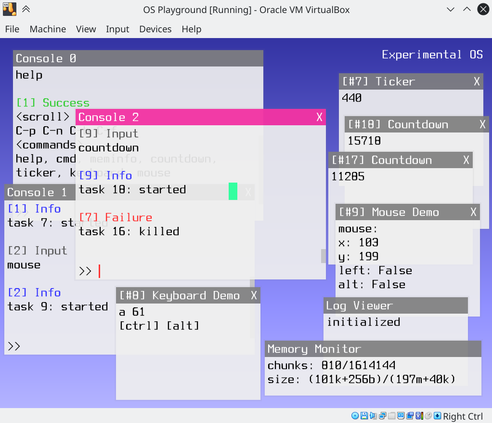

OS Playground (Archived)
====

This is an experimental OS-from-scratch project. Just for demonstration, not useful at all.

Different from OS in other projects, this OS is completely libC-free and assumes an interpreted language is used as the only userland language. Although I did NOT have enough time to design a new language and write an interpreter for it, the scheduler of this OS assumes userland programs are executed by a VM, and the memory for userland is automatically managed in kernel-level (no paging, no virtual memory).

I don't have any prior OS development experiences. Therefore, the implementation is naive. But it can be a PoC of the OS design based on non-native userland mechanics.

To build it, just run `make` in your GNU/Linux command-line. Install missing dependecies if error occurred. After build finished successfully, an ISO disk image will be generated in the `build` directory, which can be used in VirtualBox or other emulators. (make sure x64 and EFI both enabled in your configuration)

